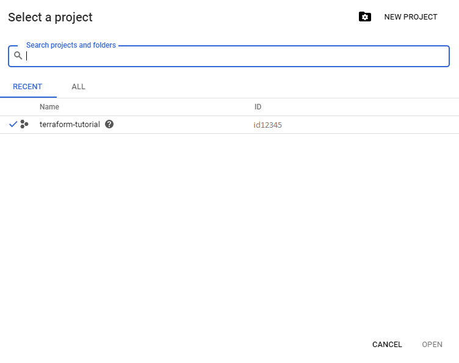

## Creating terraform config file

**GCP service account key**: Terraform will access your GCP account by using a service account key. [Create one now](https://console.cloud.google.com/apis/credentials/serviceaccountkey) in the console. When creating the key, use the following settings:

- Select the project you created in the previous step.
- Under "Service account", select "New service account".
- Give it any name you like.
- For the Role, choose "Project -> Editor".
- Leave the "Key Type" as JSON.
- Click "Create" to create the key and save the key file into this cloned repo and rename it to `cloud_access_key.json`.


Replace `<ID>`  at line 14 in `main.tf` with your GCP project id.

You can check your project id in your gcp console.




## Create a local SSH key

```shell-session
ssh-keygen -t rsa -C "your_email@example.com" -f ./tf-cloud-init
```


## Add your public SSH key to your cloud-init script

open `scripts/add-ssh-web-app.yaml` and replace `ssh-rsa blah blah` with your ssh key created above.


## Deploying

To deploy simply run the `deploy.bat`

or

```shell
terraform plan -out plan
terraform apply plan
```

#### 

## Destroying

To destroy simply run the `destroy.bat`

or

```shell
terraform destroy
```

